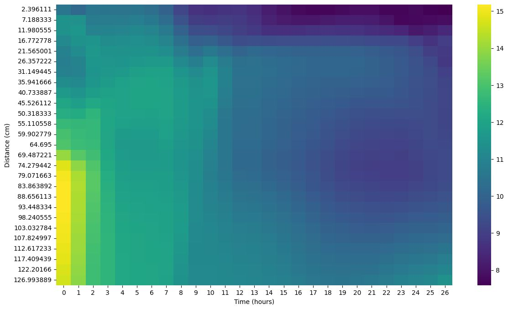

# 🧪 Argon Gas Flow Optimization for Consistent Multicrystalline Silicon Growth in Directional Solidification Furnace Using Machine Learning

## 📌 Overview

This project presents an AI-driven method for optimizing Argon gas flow in a Directional Solidification Furnace (DSF), which is critical for the growth of multicrystalline silicon (mc-Si) used in photovoltaic applications. It aims to minimize carbon impurities by stabilizing CO gas concentration using a data-driven approach.

---

## 🧠 Problem Statement

- CO back-diffusion in the furnace increases impurity levels in the crystal.
- Current experimental/simulation methods are expensive and time-consuming.
- Objective: Minimize CO gas fluctuation to improve mc-Si purity using machine learning.

---

## 🛠️ Methodology

- **Model**: LSTM for predicting gas concentration over time.
- **Optimization**: Two-stage process
  - Simulated Annealing with Random Restarts
  - Gradient Descent for refinement
- **Loss Function**:
  - Spatial consistency
  - Temporal consistency
  - Weighted deviation penalties

---

## 📊 Dataset

- Collected CO gas concentration hourly for 26 hours.
- Flow rates from 1 to 14 LPM.
- Data formatted as: `(lpm, time, distance) → concentration`.
- Minimal preprocessing to maintain physical accuracy.

---

## 🤖 Model Details

- **LSTM Model**: Captures temporal dependencies.
- **Optimizer**: Adam
- **Loss Function**: Mean Squared Error (MSE)
- **Validation Loss**: ~3.06

---

## 🧪 Results

- **Optimization Configuration**:
  - Initial Temperature: 1000.0
  - Min Temp: 1e-6
  - Cooling Rate: 0.99
  - Max Iterations: 10,000
  - Max Restarts: 40
  - Tolerance: 1e-3
- **Final Loss**: 66.7

---

## 📷 Visual Results

Below are sample visuals extracted from the study:

---

## ✅ Conclusion

- This work proves that AI can significantly reduce impurity in mc-Si production.
- It’s a scalable and cost-effective alternative to traditional methods.
- The framework can incorporate new constraints for broader use cases.

---

## 🧰 Tech Stack

- Python
- TensorFlow/Keras
- NumPy, Matplotlib
- Custom Optimization Logic

---

## 🔗 Acknowledgments

Conducted as part of a research initiative focused on AI in materials science.

---

## 📄 License

This project is licensed under the MIT License.